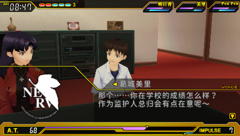
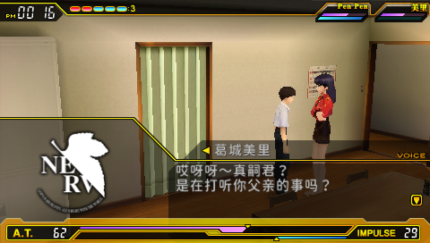
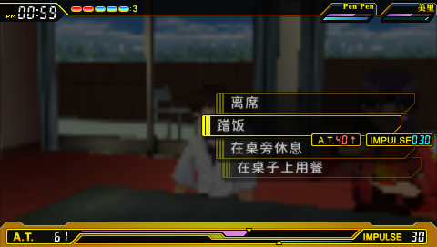
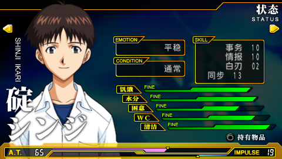

<!-- markdownlint-disable MD001 MD041 -->
<p align="center">
  
</p>

<h3 align="center">
《新世纪福音战士 2 ：被创造的世界》汉化计划
</h3>

<p align="center">
| <a href="https://paratranz.cn/projects/10882"><b>翻译平台</b></a> 
| <a href="https://github.com/rezual/nge_2_re/"><b>原项目</b></a> 
| <a href="https://forum.evageeks.org/thread/1393/Game-Neon-Genesis-Evangelion-2-Another-Cases/700/"><b>原帖</b></a> 
| <a href="https://github.com/xeonliu/nge_2_re/discussions"><b>讨论区</b></a> 
| <a href="https://github.com/xeonliu/nge_2_re/issues"><b>反馈问题</b></a> 
|
</p>

---

> 本项目最初 Fork 自 [rezual/nge_2_re](https://github.com/rezual/nge_2_re/)，致力于为 PSP 游戏《新世纪福音战士 2：被创造的世界》制作**完整、可复现的中文汉化补丁**。  
>  
> 我们专注于**文本结构解析、翻译管理、自动补丁构建**，以重现这款复杂游戏的内部机制与叙事魅力。

### 屏幕截图

<p float="left">
  
  
</p>

<p float="left">
  
  
</p>

### 📰 最新进展

- [2026/01] 支持 CMake 构建，移除 PRX 依赖，修改界面语言，添加开始菜单
- [2025/12] 实现HGPT、TEXT、BIND文件的处理，生成 GUI 程序
- [2025/10] 引入 GPT 翻译与文本格式自动检测模块
- [2025/09] 建立完整数据库与导入导出工具链
- [2025/08] 成功实现 EBOOT 动态修改与编码映射修复
- [2025/07] 代码重构，更新码表避开特殊字符；召开第一次汉化小组会议
- [2025/05] Belfraw 加入项目
- [2025/04] 建立 QQ 群

<details>
<summary>查看完整历史</summary>

#### 2026 年

- **[01/31]** 添加 ULJS00061 补丁生成
- **[01/24]** 添加开始菜单
- **[01/22]** 进行性能优化，将导入/导出时间压缩到30秒左右。
- **[01/28]** 支持 CMake 构建，移除 Font_Hack 依赖。修改 `sceFontFindOptimumFont` 函数调用
- **[01/26]** 劫持存档函数，将语言参数修改为简体中文。
- **[01/22]** 使用 Qwen3-VL 进行文字识别
- **[01/16]** Frykte 加入项目

#### 2025 年

- **[12/10]** 实现 TEXT 文本导入导出
- **[12/09]** 实现 HGPT 图像导入导出
- **[07/08]** Laolv000 加入项目，汉化交流工作转移到 QQ 群
- **[07/06]** Asuka 和 yokuse 加入项目
- **[07/05]** 召开第一次汉化小组会议
- **[07/03]** 代码重构，更新码表避开特殊字符
- **[05/17]** Belfraw 加入项目
- **[04/27]** 建立 QQ 群
- **[02/14]** hanDragon20 加入项目
- **[02/13]** カロモリモキナエ 加入项目
- **[02/01]** 撰写脚本检查翻译格式
- **[01/29]** 使用哈希函数对 EVS 文件去重

#### 2024 年

- **[09/16]** 开始使用 Meta-Llama-3-8B-Instruct 模型进行辅助翻译
- **[08/29]** Tianying.exe 加入项目
- **[07/18]** mel 加入项目；对游戏官网历史版本进行存档并部署在 GitHub Pages 上，并将当时的游戏 PV 转载到 Bilibili；本站开始构建
- **[07/15]** Liana384 加入项目
- **[07/12]** 菜单文本汉化测试通过
- **[07/08]** 将项目迁移至 Paratranz
- **[06/29]** 对可执行文件中文本依内存地址分为 176 组
- **[06/27]** 撰写部分 Python 脚本用于实现文本码表的替换；生成第一版测试汉化，视频发布于 Bilibili
- **[06/21]** 发布《EVA 游戏汉化招募》帖子，开始在一定范围内寻求翻译贡献者
- **[06/14]** 逆向出了编码转换的实现，找出游戏中"码表"的地址；将可执行文件中待翻译文本上传至 Crowdin，开始使用 DeepL 进行机器翻译
- **[04/19]** 发布题为《对 PSP 游戏进行逆向并汉化的研究》的帖子，找出字符读取、编码转换的函数地址

</details>


## 📖 关于本项目

项目结构如下：

```
app/
├─ cli/      # 主程序
├─ gui/      # 图形化程序
├─ database/      # SQL数据库定义
├─ elf_patch/      # 生成 SJIS 文本翻译文件 EBTRANS.BIN
├─ parser/tools/   # 资源解析脚本（修改自原仓库）
plugin/
├─ 启动器与内存修改逻辑（C 语言）
scripts/
├─ paratranz/      # Paratranz 文本导入导出工具
├─ mt/             # 机器翻译工具
├─ pack/           # 打包工具
````

## 🗺️ 适用镜像

+ [ULJS-00061](http://redump.org/disc/96458/)
+ [ULJS-00064](http://redump.org/disc/101162/)

二者存档互通，均标识为 `ULJS00061`。

---

## 🚀 Roadmap

- [x] 关系型数据库存储解析内容  
- [x] 一键导出与导入待翻译文本  
- [x] 引入大模型（如 Sakura）进行机翻  
- [x] 完整项目结构可一键 Patch  
- [x] 翻译问题自动报告与统计  
- [x] 扩展字库与动态修改支持  
- [x] 构建 Docker 镜像  
- [x] 自动生成 Patch（XDelta）  
- [x] 搭建汉化项目网站  
- [x] 自动导入导出 HGAR
- [x] 自动导入导出 TEXT 资源
- [x] 自动导入导出 BIND 资源
- ~~[x] GUI 汉化工具~~
- [x] 使用视觉大模型进行图片文字识别
- [ ] 修改游戏贴图
- [x] 自动导出贡献图表

---

## 🧰 开发环境

### 使用 VSCode + Docker

1. 安装 **Dev Containers** 插件  
2. 打开项目后选择 **Reopen in Container**

### 从源码构建

```bash
# 安装 UV（现代 Python 包管理器）
pip install uv
# 或按官方说明安装
# https://docs.astral.sh/uv/

# 配置 PSPDEV 工具链
export PSPDEV=/usr/local/pspdev
export PATH=$PATH:$PSPDEV/bin
````

### 使用 Docker

```bash
docker build -t pspdev-dev .
docker run -it --rm -v $(pwd):/app -w /app pspdev-dev
```

---

## 🎮 使用指南

目前，补丁以 [xdelta3](https://github.com/jmacd/xdelta) 格式发布。

桌面端可以使用 [DeltaPatcher](https://github.com/marco-calautti/DeltaPatcher)，网页端可以使用 [xdelta-wasm](https://kotcrab.github.io/xdelta-wasm/) 打补丁，使用步骤如下：

1. 获取适用的镜像（使用正版 UMD 光盘和已破解的 PSP 提取 ISO 镜像，参考 [miscdumpingguides](https://miscdumpingguides.miraheze.org/wiki/PlayStation_Portable_Physical_Software_Dumping_Guide)）
2. 从 GitHub Release 下载对应版本的补丁
3. 打开 DeltaPatcher 或 xdelta-wasm
4. 依次打开适用的镜像和对应的补丁文件，点击`Apply Patch`或对应按键
5. 程序会自动生成新的 ISO 镜像文件，该镜像文件可以在 PPSSPP 模拟器或 PSP 实机上加载

### PPSSPP 模拟器

* iOS 设备推荐将 CPU 核心模式改为 “解释器” 以减少 JIT 带来的性能损失

### PSP 实机

* 需要已破解设备（推荐 **ARK-4**），可直接运行补丁版镜像。

---

## 🤝 贡献

本项目的翻译文本托管于 [Paratranz 平台](https://paratranz.cn/projects/10882)。
翻译指南与任务分配将于平台内公布。
图片资源正在整理中。

---

## ⚖️ 版权与协议

* 源代码使用 [GPL-3.0](https://www.gnu.org/licenses/gpl-3.0.en.html) 开源
* 中文翻译文本使用 [CC BY-NC-SA 4.0](https://creativecommons.org/licenses/by-nc-sa/4.0/) 协议
* 原日文文本与英文翻译版权归原作者所有

---

## 💬 联系我们

* 技术问题与功能请求请提交 [GitHub Issues](https://github.com/xeonliu/nge_2_re/issues)
* 翻译交流请加入 [Paratranz 社区](https://paratranz.cn/projects/10882)
<!-- * 项目合作与联络：[eva2-translation@proton.me](mailto:eva2-translation@proton.me) -->

---

## 🌟 致谢

感谢以下项目和组织的启发与支持：

* [rezual/nge_2_re](https://github.com/rezual/nge_2_re)
* [tpunix/pgftool](https://github.com/tpunix/pgftool) 用于 PSP 字体生成
* [Linblow/pspdecrypt](https://github.com/Linblow/pspdecrypt)
* [jmacd/xdelta](https://github.com/jmacd/xdelta)
* [Illidanz/hacktools](https://github.com/Illidanz/hacktools)
* [pngquant](https://pngquant.org)
* [Paratranz](https://paratranz.cn)
* [PPSSPP](https://www.ppsspp.org/)
* [PSPDev 工具链](https://pspdev.github.io/)
* 全体参与汉化与校对的志愿者们 ❤️
