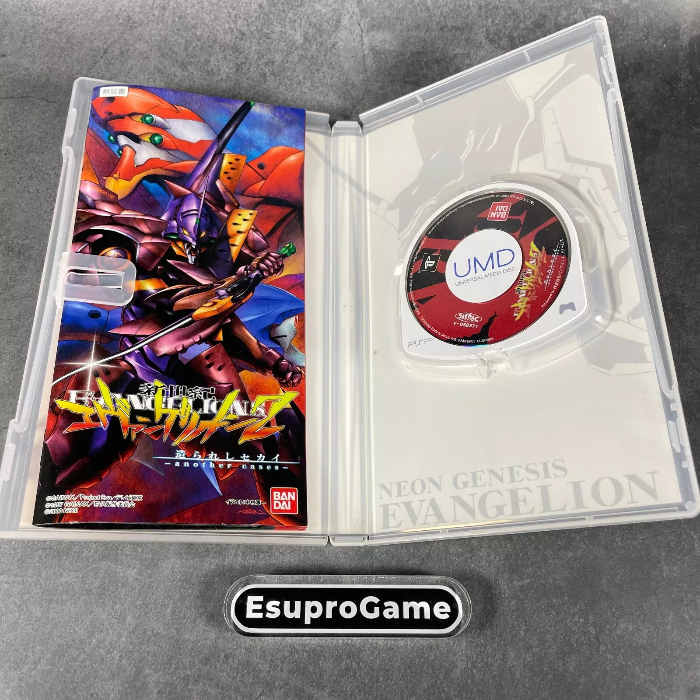
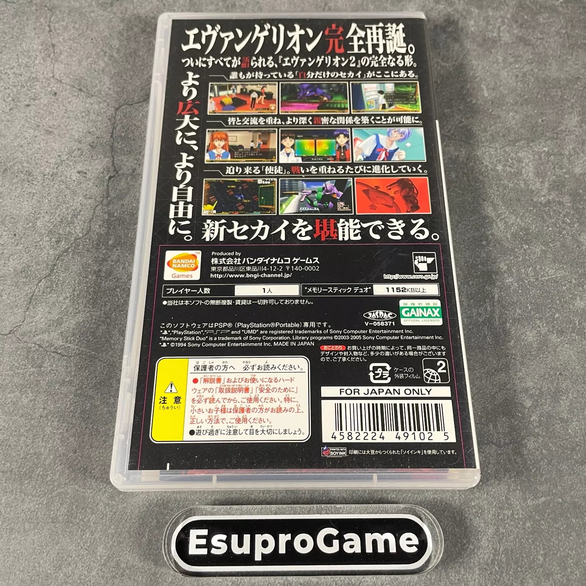
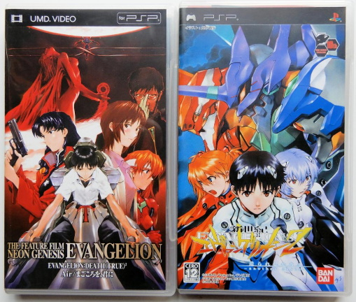
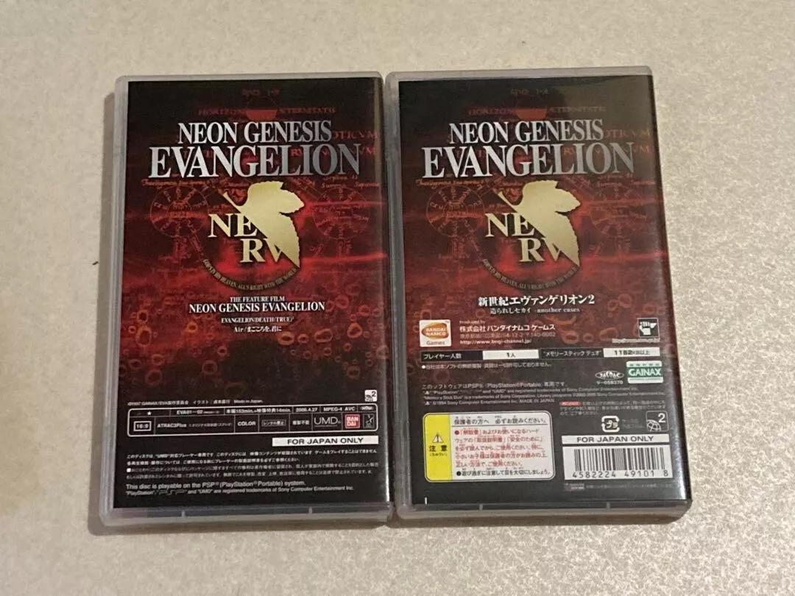
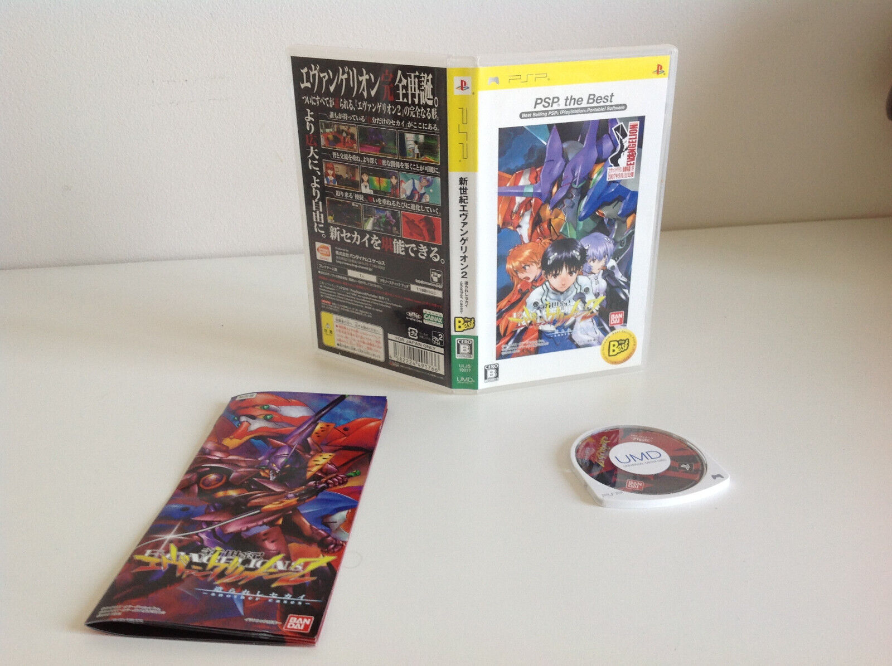

## 官网

- [Bandai](http://www.bandaigames.channel.or.jp/list/psp_eva2/)（已失效）（[GitHub 存档](https://xeonliu.github.io/eva2_archive/)）
- [Alfa System](http://www.alfasystem.net/game/evapsp/)

## 版本

参考资料：[PSP DataCenter](https://psxdatacenter.com/psp/ntsc-j_list.html)

### ULJS-00064 单碟装




- 条形码：4582224491025
- 发售时间：2006/04/27
- 价格：5,040 JPN

### ULJS-00061 十周年纪念装（游戏+旧剧场版）




- 条形码：4582224491018
- 发售时间：2006/04/27
- 价格：10,500 JPN

```
【基本情報】
■タイトル:新世紀エヴァンゲリオン -DECADE-(新世紀エヴァンゲリオン2 造られしセカイ -another cases-) 10周年記念メモリアルBOX(限定版)
■機種:プレイステーションポータブルソフト(PlayStation PortableGame)
■発売日:2006/04/27
■メーカー品番:ULJS-00061
■JAN/EAN:4582224491018
■メーカー:バンダイナムコエンターテインメント
■ジャンル:ワールドシミュレーター
■対象年齢:CERO 12才以上対象
■プレイ人数:1人

【商品説明】
■10周年記念メモリアルBOX同梱物
◇PSPソフト「新世紀エヴァンゲリオン2 造られしセカイ -another cases-」
◇UMD Videoソフト「劇場版 新世紀エヴァンゲリオン DEATH(TRUE)2/Air/まごころを、君に」
◇メモリアルBOX

テレビアニメーション放送より10年を経た今でも全く衰えぬ人気を誇る「新世紀エヴァンゲリオン」のゲームの新作であるPSP(プレイステーション・ポータブル)向けソフト「エヴァンゲリオン2 造られしセカイ -another cases-」と作品初のUMD Video化である「劇場版 新世紀エヴァンゲリオン DEATH(TRUE)2・Air/まごころを、君に」をカップリングした『エヴァンゲリオン10周年記念作品』です!

◇「新世紀エヴァンゲリオン2 造られしセカイ -another cases-」とは
生まれ変わった「エヴァンゲリオン」のセカイ。「エヴァンゲリオン」を再現したセカイを、キャラクターの1人となり物語を紡いでいくワールドシミュレーターです。
プレイステーション2ソフト「エヴァンゲリオン2」をベースに、シナリオ・グラフィックをはじめ、全ての要素を大幅に強化しました。
『PSP』の性能を活かした美麗なグラフィックと洗練されたシステムを備えた、正に決定版といえます。

■権利表記:©GAINAX/Project Eva.・テレビ東京 © 1997 GAINAX/EVA製作委員会 © BANDAI 2006
```

```
ULJS-00061
Neon Genesis Evangelion – Decade Memorial Box

Revival of Evangelion [contains Death(True)² + The End of Evangelion]

MSRP: ¥10,500

Release Date: 4/27/2006

Packaging: Box holding 1x 2-UMD case (movie), 1x standard UMD case (game)

Video: 480p AVC (1.85:1 anamorphic)

Audio: ATRAC3plus stereo

Notes: Collector’s box w/ “Shin Seiki Evangelion 2: Tsukurareshi Sekai - Another Cases” game.  Requires a Japanese or European PSP to play the movie UMDs, but the game is region-free.
```

### ULJS-19017 PSP the Best



- 发售时间：2007/08/30（恰好为《新剧场版：序》上映前一天）
- 价格：2,800 JPN

```
【基本情報】
■タイトル:新世紀エヴァンゲリオン2 造られしセカイ～another cases～PSP the Best(ULJS-19017)
■機種:プレイステーションポータブルソフト(PlayStation PortableGame)
■発売日:2007/08/30
■メーカー品番:ULJS-19017
■JAN/EAN:4582224491766
■メーカー：バンダイナムコエンターテインメント
■ジャンル：ワールドシミュレーター
■対象年齢：CERO B 12才以上対象
■プレイ人数：1人

【商品説明】
お求めやすい価格で登場!シナリオごとに変わるキャラクターを操り、「エヴァンゲリオン」の世界を体験。登場人物になりきって原作とおりのストーリーを歩むか、違った道を歩むかはプレイヤー次第!
■権利表記：©GAINAX・カラー / Project Eva. ©GAINAX・カラー / EVA製作委員会 ©2006 NBGI
```