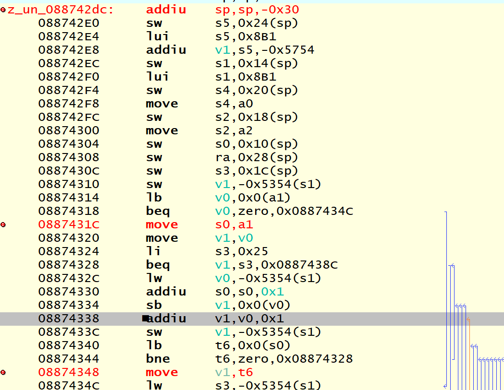

使用Rizin进行覆盖
65344
z_un_886868da4
都是正确的值
地址运算规则

611b

addi a1,a1,0xFFFF
addiu a2,a1,-0xA0
addiu sp,sp,-0x10
sltiu v1,a2,
beq v1,zero,0x08867A08
lw a0,0x20(a0)
lbu a2,0x5(a0)
andi t9,a2,0x4
bne t9,zero,0x08867AE4
jal z_un_088691b0
addiu sp,sp,-0x10
sw ra, 0x0(sp)
jal z_un_08884680
------------
addiu sp,sp,-0x10
sw s1,0x4(sp)
...
sw s0,0x0(sp)

andi a0,a0,0xFFFF
lw ra,0x0(sp)
jr ra
addiu sp,sp,0x10

进行language patch
关注`0x001B1880: Data(DataType.String, 72, (0x8C, 0xB4, 0x8D, 0xEC`
elf:rodata:0x001B1880,ram:
08B0A8AC拷贝了字符串
s0：指向rodata。
当0x0(s0)==0时停止
z_un_088742dc:
lb v0,0x0(a1)
a0=08c90D90
a1=089b5880


z_un_08874180：得到8CB4
上面的东西都在z_un_0887233c里面

sltiu

# 码表&字库
SHIFT-JIS转换依赖于两张表。
1. 一张表是SHIFT-JIS编码前两位到对应UTF-16编码偏移量的表，
```
20 00 00 00
a1 00 5f 00
40 81 9e 00
```
+ 0x0020 - 0x007e 合计 0x5f 个字符由第二张表的第0到第0x5e字符表示。
+ 0x00a1 - 0x00df 合计 0x9e-0x5f = 0x3f 和字符从第0x5f个字符开始表示。

2. 第二张表是连续储存UTF-16编码的表。通过第一张表索引。

